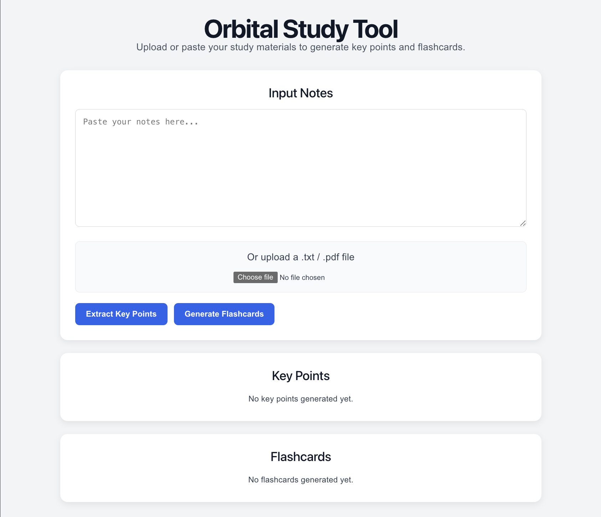
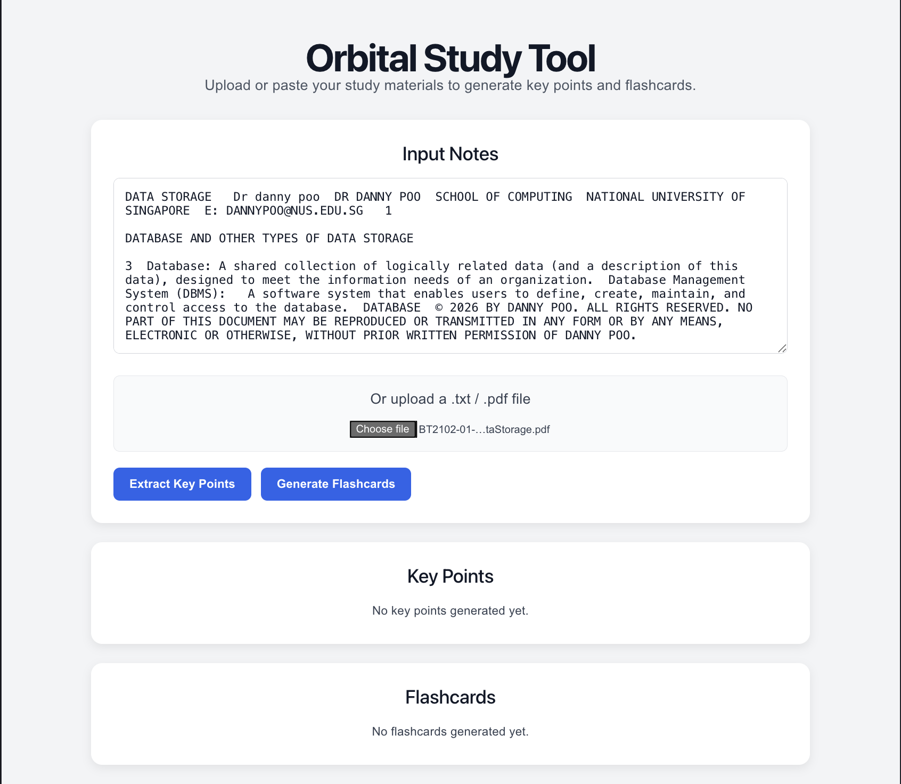
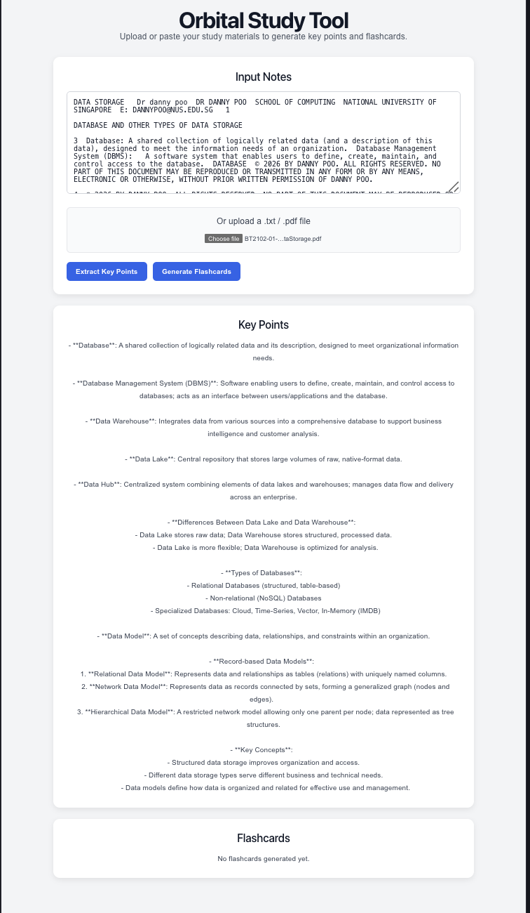
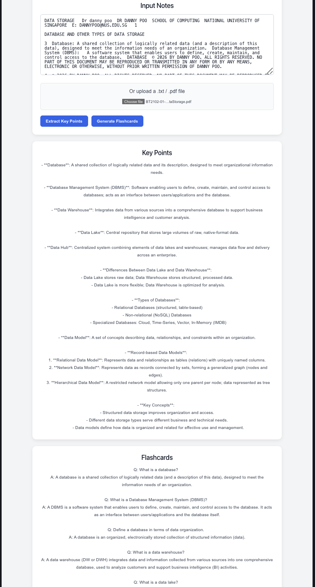

# Orbital Study Tool

## Team Members

* Javier
* Ivan

# 1. Project Overview

## Motivation

Students often have large amounts of study material, such as lecture notes, tutorial worksheets, and revision documents. However, these materials are often lengthy, unstructured, or stored in different formats, making revision difficult and time-consuming.

Although study aids such as flashcards and summary sheets can significantly improve revision efficiency, many students do not create them because the process is repetitive and requires additional effort on top of studying.

Our project is motivated by this problem. We aim to build a system that transforms existing study materials into organised and reusable revision resources, allowing students to spend less time preparing notes and more time learning and revising.

## Aim

The aim of this project is to develop a web application that allows users to upload or paste study materials and automatically generate structured revision content.

The system currently focuses on two primary outputs:

* Key point summaries
* Flashcards for self-testing

By automating the conversion of raw study materials into revision resources, we hope to create a practical and easy-to-use tool that supports more effective learning.

# 2. User Stories

The application is designed to support students throughout the revision process by transforming raw study materials into structured revision resources. The following user stories capture the primary use cases that guided the development of the system.

### User Story 1

As a student who wants to revise more efficiently, I want to upload my notes so that I can turn them into more useful study materials.

### User Story 2

As a student who wants to test my understanding, I want the system to generate flashcards from my notes so that I can revise through active recall.

### User Story 3

As a student who is preparing for examinations, I want a concise summary of my notes so that I can quickly review the key concepts and information.

### User Story 4

As a user who has different studying preferences, I want to edit generated study materials so that they better suit my learning needs.

### User Story 5

As a user who wants to continue revising later, I want to save generated materials so that I can access them again in future study sessions.

# 3. Features and Design of Application

The Orbital Study Tool is designed to transform raw study materials into structured revision resources. The application follows a workflow where users submit study materials, the system processes the content, and AI-generated outputs are returned to the user.

## System Workflow

1. User pastes notes or uploads study materials.
2. The frontend sends the content to the backend.
3. The backend extracts and processes the text.
4. Important information is extracted from the content.
5. The processed content is sent to the OpenAI API.
6. Generated outputs are returned to the frontend.
7. Users can utilise the generated revision materials for studying.

---

## Feature 1: Study Material Submission and Processing

### Description

Users can either paste notes directly into the application or upload study materials in supported formats. The system processes the submitted content and extracts important information for further use.

Currently supported formats include:

* Plain text input
* TXT files
* PDF files

### Input

Users provide study materials through:

* Text input box
* File upload interface

### Processing

The system extracts text from the submitted materials.

For TXT files, the text is read directly from the uploaded file.

For PDF files, the system uses PDF text extraction to retrieve the content before processing.

The extracted text is then analysed to identify important concepts and information that may be useful for revision.

### Output

The system generates:

* Extracted key points
* Important concepts and information
* Processed content for downstream features such as flashcard generation

This allows users to quickly understand the main ideas within their study materials without manually reviewing large amounts of content.

---

## Feature 2: Flashcard Generation

### Description

This feature automatically converts study materials into flashcards for active recall practice.

Instead of manually creating question-and-answer pairs, users can generate flashcards directly from their uploaded notes and study materials.

### Input

* Processed study materials from Feature 1

### Processing

The backend sends the processed content to the OpenAI API with instructions to generate educational flashcards.

The generated flashcards are formatted into question-and-answer pairs before being returned to the frontend.

### Output

The system generates:

* Question-and-answer flashcards
* Revision-friendly study materials
* Active recall learning resources

These flashcards allow users to test their understanding of concepts covered in their study materials and support more effective revision.

---

## Feature 3: Summary Sheet Generation (Planned)

### Description

This feature will generate structured summary sheets from uploaded study materials.

The objective is to provide users with concise revision resources that highlight the most important concepts from longer notes and documents.

### Planned Input

* Processed study materials from Feature 1

### Planned Processing

The backend will analyse the uploaded content and identify important concepts, definitions, and explanations.

The system will then organise the information into a structured summary format suitable for revision.

### Planned Output

The system will generate:

* Concise revision sheets
* Structured topic summaries
* Quick-reference study materials

This feature will complement flashcard generation by providing an alternative revision format for users.

---

## Future Extensions

The following features were proposed but have not yet been implemented:

### Saving Generated Content

Users will be able to save generated flashcards and summaries for future access.

### Editing and Regeneration

Users will be able to edit generated content or request regenerated outputs if they are not satisfied with the initial results.

### Study Mode

A dedicated study interface will allow users to review flashcards directly within the application.

### Export Functionality

Users will be able to export generated study materials into downloadable formats for offline revision.

# 4. System Architecture

The Orbital Study Tool follows a client-server architecture consisting of a React frontend, an Express backend, and external AI services.

## High-Level Architecture

```text
User
  ↓
React Frontend
  ↓
Express Backend
  ↓
OpenAI API
  ↓
Generated Results
  ↓
Frontend Display
```

### Frontend

The frontend is developed using React and Vite.

Its responsibilities include:

* Accepting user input
* Handling file uploads
* Displaying generated outputs
* Managing user interactions

Users interact with the system through a web-based interface where they can paste notes, upload files, and view generated revision materials.

---

### Backend

The backend is implemented using Node.js and Express.

Its responsibilities include:

* Receiving requests from the frontend
* Processing uploaded content
* Communicating with the OpenAI API
* Returning generated outputs to the frontend

The backend acts as the intermediary between the user interface and the AI processing services.

---

### OpenAI Integration

The application uses the OpenAI API to generate educational content from uploaded study materials.

The API is currently used for:

* Key point extraction
* Flashcard generation

The backend constructs prompts and sends the processed study material to the API before returning generated outputs to the frontend.

---

### File Processing Pipeline

TXT files:

1. User uploads TXT file.
2. Frontend reads file contents.
3. Extracted text is sent to the backend.

PDF files:

1. User uploads PDF file.
2. The frontend uses pdfjs-dist to extract text.
3. Extracted text is sent to the backend.
4. The backend processes the content before AI generation.

---

### Data Flow

The overall data flow within the application is as follows:

1. User submits study materials.
2. Frontend extracts text from uploaded files.
3. Backend receives the processed content.
4. OpenAI API generates educational outputs.
5. Generated outputs are returned to the frontend.
6. Users review the generated study materials.

# 5. Development Plan

The project follows an incremental development approach. We first focused on building a working end-to-end system before progressively improving functionality and usability.

## Milestone 1 – Technical Proof of Concept

### Objectives

* Set up the frontend and backend architecture.
* Establish communication between frontend and backend.
* Implement study material submission and processing.
* Implement flashcard generation.
* Build a complete workflow from user input to generated output.

### Planned Deliverables

* Basic frontend-backend integration
* Feature 1 implemented at a basic level
* Feature 2 implemented at a basic level

### Current Status

Completed:

* React frontend setup
* Express backend setup
* Frontend-backend integration
* OpenAI API integration
* TXT file upload support
* PDF file upload support
* Key point extraction
* Flashcard generation
* Improved user interface
* Loading indicators and error handling

Milestone 1 objectives have been successfully achieved.

---

## Milestone 2 – Prototype

### Planned Objectives

* Implement summary sheet generation.
* Improve output quality and formatting.
* Add database integration for saving generated content.
* Improve user experience and interface design.

### Planned Deliverables

* Feature 1 completed
* Feature 2 improved
* Feature 3 implemented
* Feature 4 implemented

---

## Milestone 3 – Extended System

### Planned Objectives

* Implement editing and regeneration functionality.
* Add study mode for reviewing flashcards.
* Support exporting generated content.
* Improve overall usability and integration.

### Planned Deliverables

* Feature 5 implemented
* Feature 6 implemented
* Feature 7 implemented
* Fully integrated study tool with both core and extension features

# 6. Current Progress and Technical Proof

## Current Implementation Status

The current system successfully supports the core workflow from study material submission to AI-generated revision materials.

The following functionalities have been implemented:

### Study Material Submission and Processing
- Manual note input
- TXT file upload
- PDF file upload
- Text extraction from uploaded files
- Key point extraction

### Flashcard Generation
- AI-powered flashcard generation
- Question-and-answer output generation
- Integration with uploaded study materials

### User Interface Improvements
- Card-based interface design
- Loading indicators during AI processing
- Error handling for failed requests
- Improved readability and organisation of outputs

---

## Technical Proof

The screenshots below demonstrate the successful implementation of the core Milestone 1 features.

### Screenshot 1: Main Application Interface



**Description:**

The main application interface allows users to paste notes directly into the system or upload study materials in TXT and PDF formats. Users can then choose to extract key points or generate flashcards from the submitted content.

---

### Screenshot 2: Study Material Upload



**Description:**

The application successfully extracts text from uploaded PDF documents and populates the input area with the processed content. This demonstrates the file upload and text extraction workflow.

---

### Screenshot 3: Key Point Extraction



**Description:**

The system processes uploaded study materials and extracts important concepts and information to create concise revision notes. This feature helps users quickly identify the most relevant content from lengthy study materials.

---

### Screenshot 4: Flashcard Generation



**Description:**

The application uses the OpenAI API to generate question-and-answer flashcards from uploaded study materials. These flashcards support active recall learning and provide users with an effective revision tool.

---

## Evaluation Against Milestone 1 Goals

The primary objective of Milestone 1 was to establish a complete workflow from study material submission to AI-generated outputs.

This objective has been successfully achieved through:

- Frontend-backend integration
- OpenAI API integration
- TXT file upload support
- PDF file upload support
- Key point extraction
- Flashcard generation
- Functional and responsive user interface

The current implementation demonstrates a working proof of concept and establishes a strong foundation for future development. Planned future enhancements include summary sheet generation, content persistence, and additional study support features.

# 7. Documentation of System

## Overview

The Orbital Study Tool follows a client-server architecture consisting of a React frontend, an Express backend, and the OpenAI API.

The frontend is responsible for user interaction and displaying results, while the backend handles file processing, AI communication, and response generation.

---

## Frontend Components

### App.jsx

The main frontend component is responsible for:

- Accepting user input
- Handling TXT and PDF uploads
- Sending requests to the backend
- Displaying generated key points
- Displaying generated flashcards
- Managing loading states and error messages

### User Interface

The user interface consists of:

- Input Notes section
- File Upload section
- Extract Key Points button
- Generate Flashcards button
- Key Points display area
- Flashcards display area

The interface is designed to provide a simple workflow from study material submission to revision material generation.

---

## Backend Components

### server.js

The backend is implemented using Node.js and Express.

Responsibilities include:

- Receiving requests from the frontend
- Processing study materials
- Communicating with the OpenAI API
- Returning generated outputs
- Handling errors and validation

The backend acts as the central controller of the application.

---

## API Endpoints

### POST /api/process-notes

#### Purpose

Processes study materials and extracts key points.

#### Input

```json
{
  "notes": "study material content"
}
```

#### Output

Generated key points and important concepts extracted from the submitted content.

---

### POST /api/generate-flashcards

#### Purpose

Generates flashcards from submitted study materials.

#### Input

```json
{
  "notes": "study material content"
}
```

#### Output

Question-and-answer flashcards generated from the provided study material.

---

## File Processing

### TXT File Processing

Workflow:

1. User uploads a TXT file.
2. The frontend reads the file contents.
3. Extracted text is placed into the input field.
4. Content is sent to the backend for AI processing.

---

### PDF File Processing

Workflow:

1. User uploads a PDF file.
2. The frontend uses pdfjs-dist to extract text.
3. Extracted content is displayed in the input area.
4. Content is sent to the backend.
5. AI-generated outputs are returned to the user.

This allows users to work directly with lecture notes, study guides, and educational materials stored as PDF documents.

---

## External Services

### OpenAI API

The application uses the OpenAI API to generate educational content.

Current use cases include:

- Key point extraction
- Flashcard generation

The API receives processed study materials and returns structured outputs suitable for revision and learning.

---

## Error Handling

The application includes basic error handling mechanisms:

- Empty input validation
- API request error handling
- File upload validation
- Processing status indicators

These mechanisms help improve reliability and provide feedback to users when issues occur.

---

## Current Limitations

The current version of the system has several limitations:

- Generated content quality depends on the uploaded study material.
- Very large documents may increase processing time.
- Generated outputs cannot currently be saved.
- Summary sheet generation has not yet been implemented.

These limitations will be addressed in future development milestones.

# 8. Installation and Setup

## Prerequisites

Before running the application, ensure that the following software is installed:

- Node.js
- npm
- Git
- Visual Studio Code (recommended)

An OpenAI API key is also required for AI-powered functionality.

---

## Clone Repository

```bash
git clone https://github.com/javierloh11/orbital-study-tool.git
cd orbital-study-tool
```

---

## Install Frontend Dependencies

```bash
cd frontend
npm install
```

---

## Install Backend Dependencies

```bash
cd ../backend
npm install
```

---

## Environment Variables

Create a `.env` file inside the `backend` directory.

Example:

```env
OPENAI_API_KEY=your_openai_api_key
```

---

## Running the Backend

Navigate to the backend directory and start the server:

```bash
cd backend
node server.js
```

Expected output:

```text
Server running on http://localhost:3000
```

---

## Running the Frontend

Open a second terminal and navigate to the frontend directory:

```bash
cd frontend
npm run dev
```

Expected output:

```text
Local: http://localhost:5173/
```

---

## Accessing the Application

Open the following URL in a web browser:

```text
http://localhost:5173
```

The application should display the Orbital Study Tool homepage.

---

## Using the Application

### Option 1: Paste Notes

1. Copy study materials.
2. Paste them into the input area.
3. Click **Extract Key Points** or **Generate Flashcards**.

### Option 2: Upload Study Materials

1. Click **Choose File**.
2. Select a TXT or PDF document.
3. Wait for the text to be extracted.
4. Click **Extract Key Points** or **Generate Flashcards**.

---

## Supported File Types

Currently supported:

- TXT
- PDF

Future versions may support additional document formats.

---

## Repository Structure

```text
orbital-study-tool/
│
├── frontend/
│   ├── src/
│   ├── public/
│   └── package.json
│
├── backend/
│   ├── server.js
│   ├── package.json
│   └── .env
│
├── screenshots/
│
└── README.md
```

# 9. Future Work

The current implementation establishes the foundation of the Orbital Study Tool. Future development will focus on expanding functionality, improving usability, and enhancing the overall learning experience.

## Feature 3: Summary Sheet Generation

A structured summary sheet generation feature will be implemented to provide users with concise revision notes derived from uploaded study materials. This feature will complement flashcard generation by offering an alternative revision format.

---

## Saving Generated Content

Users will be able to save generated flashcards, key points, and summary sheets for future access. This will allow users to build a personal repository of study materials over time.

---

## Editing and Regeneration

Users will be able to edit AI-generated content and regenerate outputs if they are not satisfied with the initial results. This will provide greater flexibility and customisation.

---

## Study Mode

A dedicated study interface will be introduced to allow users to review flashcards directly within the application. Features such as card flipping, progress tracking, and revision sessions may be included.

---

## Export Functionality

Users will be able to export generated study materials into downloadable formats for offline revision and sharing.

---

## Long-Term Vision

The long-term goal of the Orbital Study Tool is to provide students with an integrated AI-assisted revision platform that transforms raw study materials into personalised learning resources. By automating repetitive preparation tasks, the application aims to help students spend more time learning and less time organising study materials.

